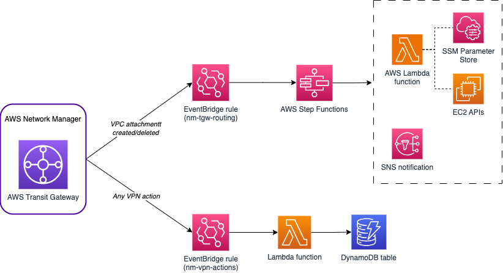

# Take advantage of AWS Network Manager Events to manage and monitor your global network

This repository shows an example of an automation solution that can be built taking advantage of [AWS Network Manager](https://docs.aws.amazon.com/network-manager/latest/tgwnm/what-are-global-networks.html) events. We provide code for this solution both using [AWS CloudFormation](./cloudformation/) and [Terraform](./terraform/).

From the [events](https://docs.aws.amazon.com/network-manager/latest/tgwnm/monitoring-events.html) delivered by Network Manager to [Amazon EventBridge](https://docs.aws.amazon.com/eventbridge/latest/userguide/eb-what-is.html), we show two possible automations:

* From [AWS Transit gateway](https://docs.aws.amazon.com/vpc/latest/tgw/what-is-transit-gateway.html) VPC attachments created, an [AWS Step Functions](https://docs.aws.amazon.com/step-functions/latest/dg/welcome.html) state machine automates the creation of associations and propagations to a Transit gateway route table.
    * An [AWS Lambda](https://docs.aws.amazon.com/lambda/latest/dg/welcome.html) function takes care of obtaining the information of the Transit gateway route table to create the routing - information provided by an [AWS Systems Manager parameter](https://docs.aws.amazon.com/systems-manager/latest/userguide/systems-manager-parameter-store.html) - and creates the association and propagation of the newly created VPC attachment.
    * An [Amazon SNS](https://docs.aws.amazon.com/sns/latest/dg/welcome.html) topic sends a notification to notify the newly VPC attachment.
* From [AWS Site-to-Site VPN](https://docs.aws.amazon.com/vpn/latest/s2svpn/VPC_VPN.html) connections, a Lambda function tracks all the related VPN actions into an [Amazon DynamoDB](https://docs.aws.amazon.com/amazondynamodb/latest/developerguide/Introduction.html) table.

The Lambda functions used in the solution can be found in the [lambda_code](./lambda_code/) folder. In addition, with the solution code, we provide an example implementation of a Transit gateway network (with VPC and VPN attachments) for testing purposes.

**IMPORTANT**: the solution has to be deployed in **us-west-2**, given that is the Home Region of Network Manager and the EventBridge events are sent to that AWS Region. However, the Transit gateway network can be built in other Regions or AWS Accounts.

* You can test multi-Region environments by simply deploying the solution code in **us-west-2** and the infrastructure code in a different Region - follow each folders instructions to understand how to make this deployment in each IaC framework type.
* For multi-Account environments, several things need to be considered:
    * Check the [Network Manager multi-account documentation](https://docs.aws.amazon.com/network-manager/latest/tgwnm/nm-multi-account.html) to see the pre-requisites and instructions to manage, monitor, and visualize [global network](https://docs.aws.amazon.com/network-manager/latest/tgwnm/global-networks.html) resources from multiple AWS accounts associated with a single organization.
    * You can deploy Transit gateways in the same Account as the global network and the solution, and create the VPC attachments in other Accounts (Transit gateway should be shared using [AWS RAM](https://docs.aws.amazon.com/ram/latest/userguide/what-is.html)). Site-to-Site VPN connections need to be created in the same Account as the Transit gateway.
    * You can deploy Transit gateways in a different Account in the same Organization. In this pattern, you need to change SSM Parameter Store by [AWS Secrets Manager](https://docs.aws.amazon.com/secretsmanager/latest/userguide/intro.html) to share between Accounts the information about the Transit gateway route tables.
* Remember that, to monitor and obtain events of Transit gateways in Network Manager, you need to [register them](https://docs.aws.amazon.com/network-manager/latest/tgwnm/tgw-registrations.html).

## Security

See [CONTRIBUTING](./CONTRIBUTING.md#security-issue-notifications) for more information.

## License

This library is licensed under the MIT-0 License. See the LICENSE file.

